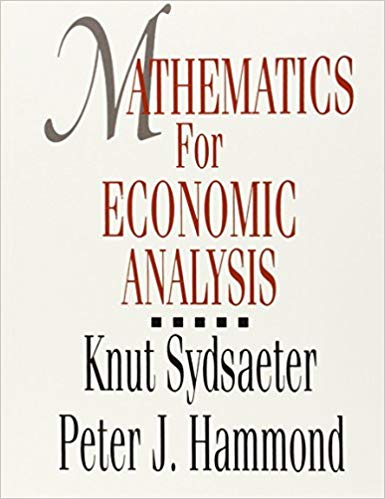

```{r setup, include=FALSE}
knitr::opts_chunk$set(echo = FALSE, include=FALSE)
```


<!-- %%%%%%%%%%%%%%%%%%%%%%%%% New section %%%%%%%%%%%%%%%%%%%%%%%%%%%%% -->
<!-- %%%%%%%%%%%%%%%%%%%%%%%%% New section %%%%%%%%%%%%%%%%%%%%%%%%%%%%% -->

# Welcome to mathematics for economics: Part 1


<!-- %%%%%%%%%%%%%%%%%%%%%%%%% New section %%%%%%%%%%%%%%%%%%%%%%%%%%%%% -->
<!-- %%%%%%%%%%%%%%%%%%%%%%%%% New section %%%%%%%%%%%%%%%%%%%%%%%%%%%%% -->

<!-- %%%%%%%%%%%%%%%%%%%%%%%%% New slide %%%%%%%%%%%%%%%%%%%%%%%%%%%%% -->
<!-- %%%%%%%%%%%%%%%%%%%%%%%%% New slide %%%%%%%%%%%%%%%%%%%%%%%%%%%%% -->


## Introduction to the course


### Information about the course
First things first... 

My name is **Rob Smith**, and I am a PhD candidate here in the Macroeconomics research group.

So that you are sure of this, I am not a mathematician with an interest in economics. I am an economist with a love for mathematics.

- These lectures are to assist you in learning.

### Language
You may have already guessed, but this course is going to be taught in **English**.

- I am fully aware that language is not everyone's stong suit.

- Do not presume that your classmates are better at English than you are.

- My Danish is definitely worse than your English, and I will happily try to speak Danish from time to time if it helps.

### Ask questions!!!
- Assume that everyone else in the room is having the same trouble understanding that you are!

- Mix Danish and English in your questions if it makes it easier. Basically do whatever is necessary to get your question asked and understood.

- If I don't know the answer, I will tell you so, and then try to find the answer (if relevant to the course).

### English as the language
- This may be frustrating at first!

- You will be very likely be grateful later on...

- The vast majority of the literature you will have access to during your degree will be in English.

### Group work
- First time working in groups?

- This is Aalborg. You are expected to help each other, and to ask each other for help if you need it.

- We will be doing some exercises in class in groups, this makes it easier to communicate with each other, and is less intimidating when you want to ask a question.

- Even though your classmates can be really helpful,
    1. When in class, always ask me or Andreas.
    2. When away from class, Step 1: always ask Google!
    3. Step 3: Ask a classmate.
    4. Step 4: Book a meeting with me.

<!-- %%%%%%%%%%%%%%%%%%%%%%%%% New section %%%%%%%%%%%%%%%%%%%%%%%%%%%%% -->
<!-- %%%%%%%%%%%%%%%%%%%%%%%%% New section %%%%%%%%%%%%%%%%%%%%%%%%%%%%% -->

<!-- %%%%%%%%%%%%%%%%%%%%%%%%% New slide %%%%%%%%%%%%%%%%%%%%%%%%%%%%% -->
<!-- %%%%%%%%%%%%%%%%%%%%%%%%% New slide %%%%%%%%%%%%%%%%%%%%%%%%%%%%% -->


## Resources
### Your textbook
**Mathematics for Economic Analysis**
by *Knut Sydsaeter*, and *Peter I. Hammond*
1994 edition

It's old, but it's good. It will also cover you for *Math Econ Part 2*.

```{r, out.width = "100px", include=TRUE, align="center"}

```


### Slides, exercises and practice questions

- All slides and lecture notes will be made available to you via **Moodle**, or via **GitHub**.

- [Moodle](https://www.moodle.aau.dk)
- [GitHub](https://github.com), you might need to sign up for an account.

### Computer programs and software
- All software that I have used to make these slides, and all software that we will use in the course is 100% free, open source and available for download.
The main ones you will want are:
1. [R distribution](https://cloud.r-project.org)
2. [RStudio](https://www.rstudio.com/products/rstudio/download/)
- Optional extras if you want to build the slides yourself:
3. 2018 TeX distribution ([MacTeX](http://www.tug.org/mactex/downloading.html) for Mac users, [MikTeX](https://miktex.org/download) for windows users)
4. RStudio Cloud can be accessed in a [Beta version online](https://rstudio.cloud), but it is not very stable yet.

### University resources
1. Journal articles are available via the [library website](http://www.aub.aau.dk).

2. Books are available from the library.

Tip: Almost anything related to Aalborg University is easier to find via a Google search, as long as you include `aau` in your search.

### Web resources
1. Khan Academy, [partially in danish](https://da.khanacademy.org/math/precalculus/precalc-matrices), or possibly just [in English](https://www.khanacademy.org/math/precalculus/precalc-matrices)
2. [EdX courses](https://www.edx.org), of which there are several.
3. [Coursera courses](https://www.coursera.org), of which there are several.
4. [3Blue1Brown - The essence of linear algebra](https://www.youtube.com/watch?v=fNk_zzaMoSs&list=PLZHQObOWTQDPD3MizzM2xVFitgF8hE_ab), a series of short videos that help with intuition, but are quite advanced. Don't be worried if you don't understand everything in them.
5. [Datacamp](https://www.datacamp.com), which is also accessible via the RStudio cloud version, is a fantastic resource for developing your programming understanding and skills.

<!-- %%%%%%%%%%%%%%%%%%%%%%%%% New section %%%%%%%%%%%%%%%%%%%%%%%%%%%%% -->
<!-- %%%%%%%%%%%%%%%%%%%%%%%%% New section %%%%%%%%%%%%%%%%%%%%%%%%%%%%% -->

<!-- %%%%%%%%%%%%%%%%%%%%%%%%% New slide %%%%%%%%%%%%%%%%%%%%%%%%%%%%% -->
<!-- %%%%%%%%%%%%%%%%%%%%%%%%% New slide %%%%%%%%%%%%%%%%%%%%%%%%%%%%% -->


## Structure of the course
### Lectures and Exercises

#### Pre-reading and examples
- All students are expected to read a minimum of the textbook content prior to the lecture.
- All students should be able to solve the examples in the text.

- Reading requirements will be posted in advance of lectures. (None for today)


### Assignments and Examination


<!-- %%%%%%%%%%%%%%%%%%%%%%%%% New slide %%%%%%%%%%%%%%%%%%%%%%%%%%%%% -->
<!-- %%%%%%%%%%%%%%%%%%%%%%%%% New slide %%%%%%%%%%%%%%%%%%%%%%%%%%%%% -->


<!-- %%%%%%%%%%%%%%%%%%%%%%%%% New section %%%%%%%%%%%%%%%%%%%%%%%%%%%%% -->
<!-- %%%%%%%%%%%%%%%%%%%%%%%%% New section %%%%%%%%%%%%%%%%%%%%%%%%%%%%% -->

<!-- %%%%%%%%%%%%%%%%%%%%%%%%% New slide %%%%%%%%%%%%%%%%%%%%%%%%%%%%% -->
<!-- %%%%%%%%%%%%%%%%%%%%%%%%% New slide %%%%%%%%%%%%%%%%%%%%%%%%%%%%% -->

